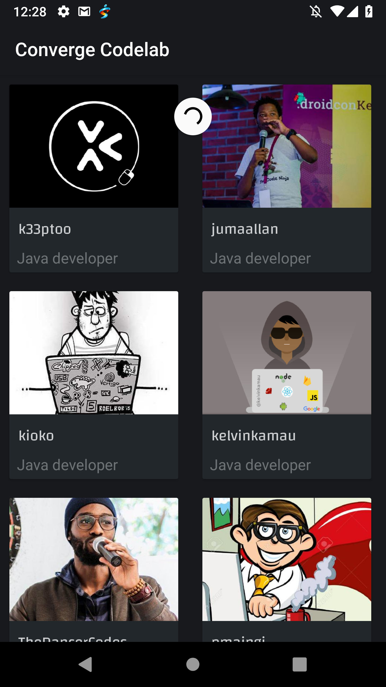
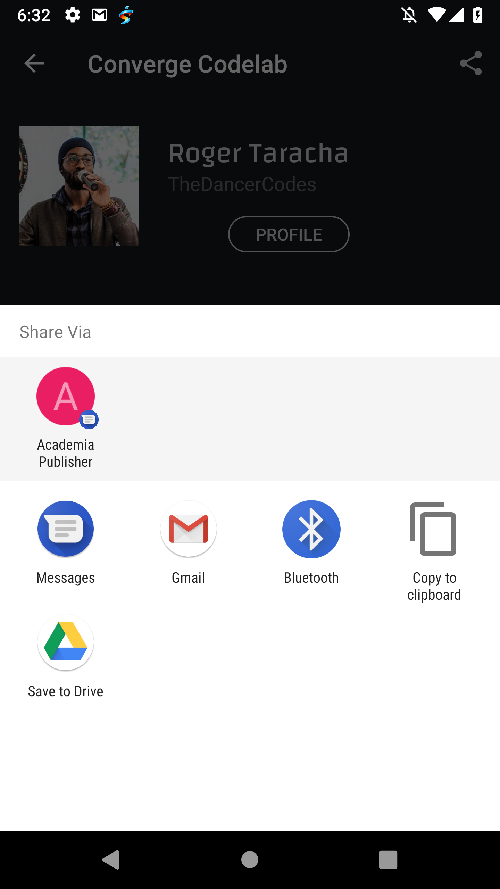
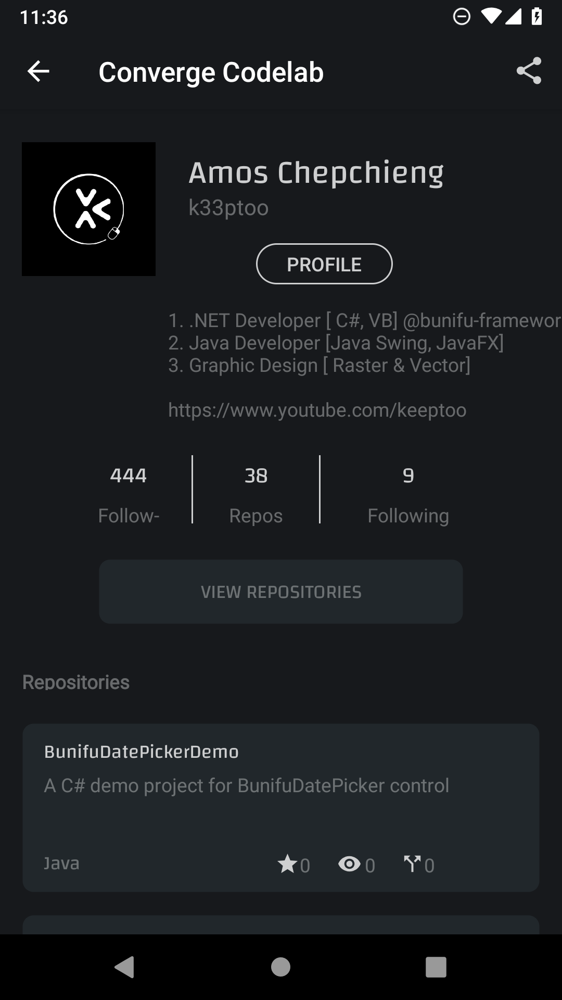

[](https://codeclimate.com/github/joeeasy/nairobi-java-developers/maintainability)
[](https://circleci.com/gh/joeeasy/nairobi-java-developers)
[](https://travis-ci.org/joeeasy/nairobi-java-developers)
[](https://codecov.io/gh/joeeasy/nairobi-java-developers)


#Java Developers In Nairobi
This application implements the [Github API](http://developer.github.com/) for fetching and displaying *Java* developers in nairobi

## Screenshots




## Getting Started

To get started with the application, you need to following the steps below

### Prerequisites

Make sure you have [Android Studio](https://developer.android.com) installed.


### Installing

```
git clone https://github.com/joeeasy/nairobi-java-developers.git
```
Or  [Download Here](https://github.com/joeeasy/nairobi-java-developers/archive/develop.zip)

Create the neccessary `ENV` variables by opening your `nano ~/.bashrc` or `nano ~/.zshrc` for ZSH terminal

```
export SLACK_URL=[link to slack workspace]
export SLACK_API_TOKEN="Slack api tokem"
export SLACK_CHANNEL=[name of slack channel you're dploying to]
```

Open project in android studio and run

```
./gradlew build
```

## Running the tests

Running the test is extremely easy, Jacoco has been setup on the project for running both unit and instrumental test
All you need is run
```
./gradlew jacocTestReport
```


## Built With

* [Java](http://www.dropwizard.io/1.0.2/docs/) - Programming language used
* [Gradle](https://maven.apache.org/) - Dependency Management
* [Android Studio](https://rometools.github.io/rome/) - IDE


## Authors

 **Jehonadab Okpukoro**
## License

This project is licensed under the MIT License - see the [LICENSE.md](LICENSE.md) file for details

## Acknowledgments

* Andela(Converage team)
* StackOverFlow

